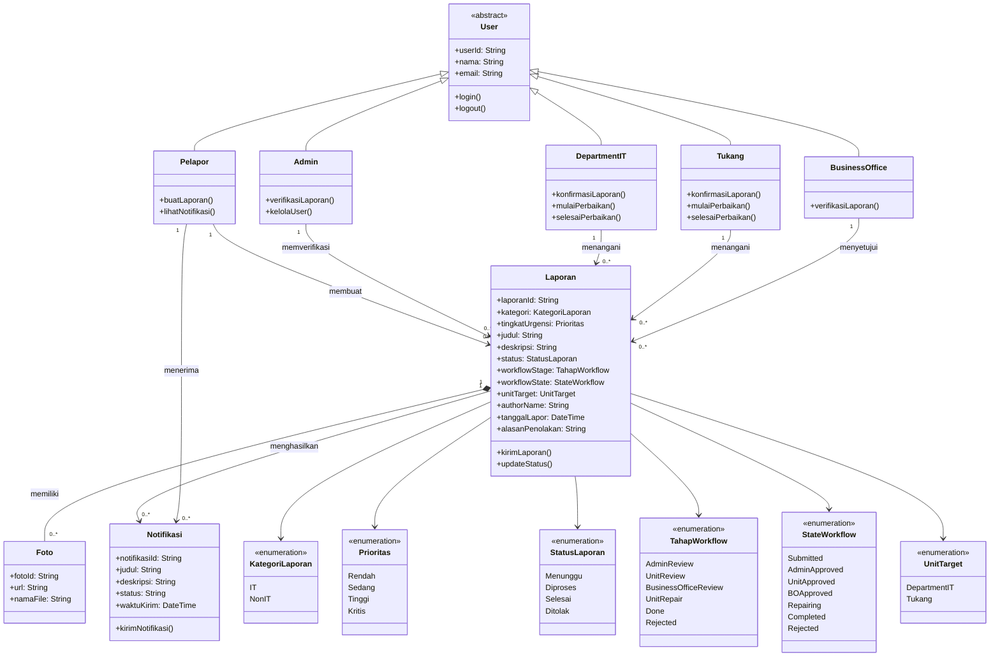

# Class Diagram UFIXED

```mermaid
classDiagram
    direction TB

    class User {
        <<abstract>>
        +userId: String
        +nama: String
        +email: String
        +login()
        +logout()
    }

    class Pelapor {
        +buatLaporan()
        +lihatNotifikasi()
    }

    class Admin {
        +verifikasiLaporan()
        +kelolaUser()
    }

    class DepartmentIT {
        +konfirmasiLaporan()
        +mulaiPerbaikan()
        +selesaiPerbaikan()
    }

    class Tukang {
        +konfirmasiLaporan()
        +mulaiPerbaikan()
        +selesaiPerbaikan()
    }

    class BusinessOffice {
        +verifikasiLaporan()
    }

    class Laporan {
        +laporanId: String
        +kategori: KategoriLaporan
        +tingkatUrgensi: Prioritas
        +judul: String
        +deskripsi: String
        +status: StatusLaporan
        +workflowStage: TahapWorkflow
        +workflowState: StateWorkflow
        +unitTarget: UnitTarget
        +authorName: String
        +tanggalLapor: DateTime
        +alasanPenolakan: String
        +kirimLaporan()
        +updateStatus()
    }

    class Foto {
        +fotoId: String
        +url: String
        +namaFile: String
    }

    class Notifikasi {
        +notifikasiId: String
        +judul: String
        +deskripsi: String
        +status: String
        +waktuKirim: DateTime
        +kirimNotifikasi()
    }

    class KategoriLaporan {
        <<enumeration>>
        IT
        NonIT
    }

    class Prioritas {
        <<enumeration>>
        Rendah
        Sedang
        Tinggi
        Kritis
    }

    class StatusLaporan {
        <<enumeration>>
        Menunggu
        Diproses
        Selesai
        Ditolak
    }

    class TahapWorkflow {
        <<enumeration>>
        AdminReview
        UnitReview
        BusinessOfficeReview
        UnitRepair
        Done
        Rejected
    }

    class StateWorkflow {
        <<enumeration>>
        Submitted
        AdminApproved
        UnitApproved
        BOApproved
        Repairing
        Completed
        Rejected
    }

    class UnitTarget {
        <<enumeration>>
        DepartmentIT
        Tukang
    }

    User <|-- Pelapor
    User <|-- Admin
    User <|-- DepartmentIT
    User <|-- Tukang
    User <|-- BusinessOffice

    Pelapor "1" --> "0..*" Laporan : membuat
    Admin "1" --> "0..*" Laporan : memverifikasi
    DepartmentIT "1" --> "0..*" Laporan : menangani
    Tukang "1" --> "0..*" Laporan : menangani
    BusinessOffice "1" --> "0..*" Laporan : menyetujui

    Laporan "1" *-- "0..*" Foto : memiliki
    Laporan "1" --> "0..*" Notifikasi : menghasilkan
    Pelapor "1" --> "0..*" Notifikasi : menerima

    Laporan --> KategoriLaporan
    Laporan --> Prioritas
    Laporan --> StatusLaporan
    Laporan --> TahapWorkflow
    Laporan --> StateWorkflow
    Laporan --> UnitTarget
```
